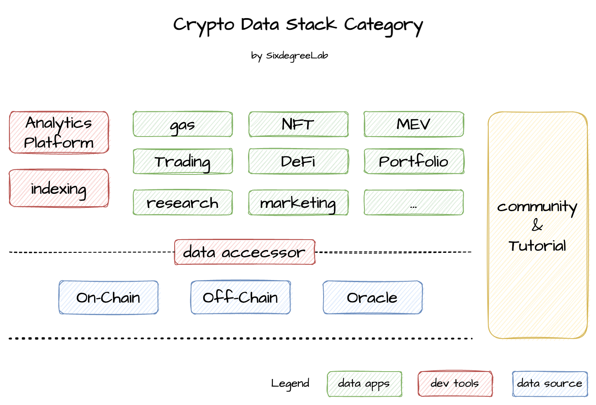

# Crypto Data Stack Wiki

版本：V0.1.0            &nbsp&nbsp&nbsp&nbsp&nbsp&nbsp&nbsp&nbsp&nbsp        更新日期：2022-10-11       

---

这是一个由[SixdegreeLab](https://twitter.com/SixdegreeLab)发起，用来收集Crypto领域各种数据相关的wiki，包括各种数据分析类应用，学习资料，开发资料等等。

> 如果你也想学习区块链领域的数据分析，或者为该资料库贡献一份力量，欢迎提交PR或者加入我们：
>
> - discord：https://discord.gg/7GHMBKEQvR
>
> - 微信群：sixdegree

---

我们整体的资料库基于以下的分类进行组织，尽量覆盖更多的涉及Crypto细分领域的数据相关资料。

## Data Source

### Chain Explorer

| **Block Chain** | **URL**                                               | **Notes** |
| --------------- | ----------------------------------------------------- | --------- |
| Bitcoin         | https://btcscan.org/                                  |           |
| Ethereum        | https://etherscan.io/                                 |           |
| BNB Chain       | https://bscscan.com/                                  |           |
| Solana          | https://explorer.solana.com/ https://solscan.io/ |           |
| Arbitrum        | https://arbiscan.io/                                  |           |
| Optimism        | https://optimistic.etherscan.io/                      |           |
| ZKSync          | https://zkscan.io/                                    |           |
| StarkNet        | https://starkscan.co/                                 |           |
| Avalanche       | https://snowtrace.io/ https://avascan.info/      |           |
| Polygon         | https://polygonscan.com/                              |           |
| sui             | https://explorer.devnet.sui.io/                       |           |
| Aptos           | https://aptoscan.com/                                 |           |
| near            | https://www.nearscan.org/home                         |           |
| Flow            | https://flowscan.org/                                 |           |
| Telos           | https://www.teloscan.io/                              |           |
| fantom          | https://ftmscan.com/                                  |           |
| Gnosis          | https://gnosisscan.io/                                |           |

> mainly focus on block chain with smart contract.

## Data Accessor

### Node Provider

### Block Chain Node

### ETL Tools

## Dev Tools

### Analytics Platform

### Indexing

## Data Apps

### Trading tools

### Portfolifo

### DeFi

### NFT

## Tutorial

- 

## Community

| Name         | URL  | Notes   |
| ------------ | ---- | ------- |
| MetricsDAO   |      | English |
| OurNetwork   |      | English |
| SixdegreeLab |      | Chinese |

