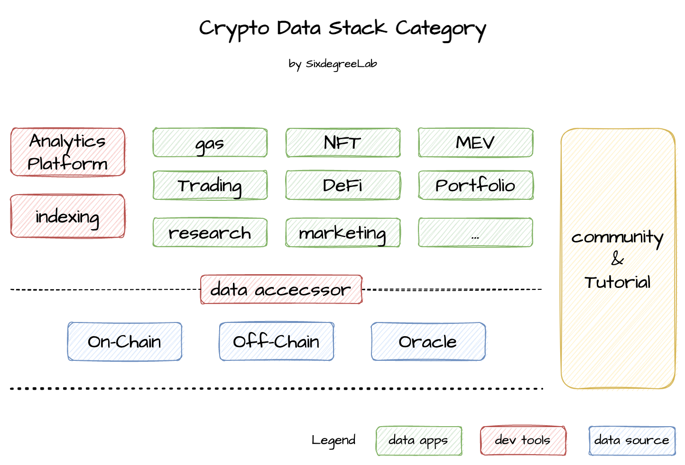

---

This repo is initiated by [SixdegreeLab](https://twitter.com/SixdegreeLab) and is used to collect various data-related products in the Crypto field, including various data analysis applications, learning materials, development materials, and more.

> If you also want to learn data analysis in the blockchain field, or contribute to this repository, please submit a PR or join us:
>
> - discord：https://discord.gg/7GHMBKEQvR
>
> - WeChat：sixdegreelab

---

Our list is organized based on the following classifications, and try to cover as many data-related materials related to crypto subdomain as possible.

## Data Apps

| Category      | Name         | URL                          | Notes |
| ------------- | ------------ | ---------------------------- | ----- |
| Trading Tools | trading view | https://www.tradingview.com/ |       |
| Trading Tools | Dex tools    | https://dextools.io/         |       |
| Trading Tools | Dexguru | https://dex.guru/ | |
| Trading Tools | Dexscreener | https://dexscreener.com/ | |
| Trading Tools | Defined | https://www.defined.fi/ | |
| Portfolifo  | debank   | https://debank.com/ ||
| Portfolifo | metamask | https://portfolio.metamask.io/ ||
| Portfolifo | Zapper   | https://zapper.fi/zh ||
| Portfolifo   | zerion   | https://zerion.io/ ||
| DeFi | DefiLlama | https://defillama.com/ ||
| NFT | NFTEye | https://nfteye.io/ ||
| NFT | NFTNerds | https://nftnerds.ai/ ||
| Layer2 | L2fees | https://l2fees.info/ ||
| Layer2 | L2beat | https://l2beat.com/scaling/tvl/ ||
| Marketing Data | CoinMarketCap | https://coinmarketcap.com/ ||
| Marketing Data | CoinGecko | https://www.coingecko.com/ ||
| Marketing Data | CryptoQuant | https://cryptoquant.com/ ||
| Marketing Data | Path | https://waitlist.pathcrypto.com/ ||
| Marketing Data | Crypto Compare | https://www.cryptocompare.com/ ||
| Marketing Data | Coin API | https://www.coinapi.io/ ||
| Marketing Data | Coin360 | https://coin360.com/ ||
| Marketing Data | DappRadar | https://dappradar.com/ ||
| Marketing Data | CryptoWatch | https://cryptowat.ch/ ||
| Enterprise Research | IntoTheBlock | https://www.intotheblock.com/ ||
| Enterprise Research | Nansen | https://www.nansen.ai/ ||
| Enterprise Research | Token Terminal | https://tokenterminal.com/ ||
| Enterprise Research | Chainanalysis | https://www.chainalysis.com/ ||
| Enterprise Research | GlassNode | https://glassnode.com/ ||
| Enterprise Research | Coin Metrics | https://coinmetrics.io/ ||
| Enterprise Research | Breadcrumbs | https://www.breadcrumbs.app/ ||
| Enterprise Research | Amberdata | https://www.amberdata.io/ ||
| Enterprise Research | MESSARI | https://messari.io/ ||
| Enterprise Research | CryptoQuant | https://cryptoquant.com/asset/btc/summary ||
| Enterprise Research | Watchers | https://www.watchers.pro/#/login ||
| MEV | EigenPhi | https://eigenphi.io/ ||
| MEV | Flashbots | https://explore.flashbots.net/ ||
| Gas | ultra sound money | https://ultrasound.money/ ||
| Gas | ETH Gas Station | https://ethgasstation.info/ ||

## Dev Tools

| Category           | Name            | URL                               | Notes |
| ------------------ | --------------- | --------------------------------- | ----- |
| Analytics Platform | Dune            | https://dune.com/                 |       |
| Analytics Platform | Flipside Crypto | https://flipsidecrypto.xyz/       |       |
| Analytics Platform | Footprint       | https://www.footprint.network/    |       |
| Analytics Platform | Luabase         | https://luabase.com/              |       |
| Analytics Platform | GeniiData       | https://geniidata.com/            |       |
| Analytics Platform | Zettablock      | https://www.zettablock.com/       |       |
| Analytics Platform | Chainbase       | https://chainbase.online/         |       |
| Analytics Platform | Transpose       | https://www.transpose.io/         |       |
| Analytics Platform | Google Bigquery | https://console.cloud.google.com/ |       |
| Indexing           | The Graph       | https://thegraph.com/             |       |
| Indexing           | GlodSky         | https://goldsky.com/              |       |
| Indexing           | SubQuery        | https://subquery.network/         |       |
| Indexing           | BitQuery        | https://bitquery.io/              |       |
| Indexing           | DappLooker      | https://dapplooker.com/           |       |
| Indexing           | web3Go          | https://web3go.xyz/               |       |

## Data Accessor

| Category      | Name         | URL                                            | Notes                                                        |
| ------------- | ------------ | ---------------------------------------------- | ------------------------------------------------------------ |
| Node Provider | Infura       | https://www.infura.io/                         |                                                              |
| Node Provider | Alchemy      | https://www.alchemy.com/                       |                                                              |
| Node Provider | BlockNative  | https://www.blocknative.com/                   |                                                              |
| Node Provider | Ankr         | https://www.ankr.com/                          |                                                              |
| Node Client   | Go-ethereum  | https://github.com/ethereum/go-ethereum        |                                                              |
| ETL Tools     | ethereum-etl | https://github.com/blockchain-etl/ethereum-etl |                                                              |
| ETL Tools     | bitcoin-etl  | https://github.com/blockchain-etl/bitcoin-etl  | ETL scripts for Bitcoin, Litecoin, Dash, Zcash, Doge, Bitcoin Cash |

## Data Source

| **Block Chain**                                              | **URL**                                                   | **Notes** |
| ------------------------------------------------------------ | --------------------------------------------------------- | --------- |
| Bitcoin | https://btcscan.org/                                      |           |
| Ethereum | https://etherscan.io/                                     |           |
| BNB Chain                                                    | https://bscscan.com/                                      |           |
| Solana                                                       | https://explorer.solana.com/    \|    https://solscan.io/ |           |
| Arbitrum                                                     | https://arbiscan.io/                                      |           |
| Optimism                                                     | https://optimistic.etherscan.io/                          |           |
| ZKSync                                                       | https://zkscan.io/                                        |           |
| StarkNet                                                     | https://starkscan.co/                                     |           |
| Avalanche                                                    | https://snowtrace.io/  \|   https://avascan.info/         |           |
| Polygon                                                      | https://polygonscan.com/                                  |           |
| sui                                                          | https://explorer.devnet.sui.io/                           |           |
| Aptos                                                        | https://aptoscan.com/                                     |           |
| near                                                         | https://www.nearscan.org/home                             |           |
| Flow                                                         | https://flowscan.org/                                     |           |
| Telos                                                        | https://www.teloscan.io/                                  |           |
| fantom                                                       | https://ftmscan.com/                                      |           |
| Gnosis                                                       | https://gnosisscan.io/                                    |           |

> Note: mainly focus on block chain with smart contract.

## Community

| Name         | URL                            | Notes   |
| ------------ | ------------------------------ | ------- |
| MetricsDAO   | https://metricsdao.xyz/        | English |
| OurNetwork   | https://ournetwork.mirror.xyz/ | English |
| SixdegreeLab | https://sixdegree.xyz/         | Chinese |

## Tutorial

| Name                    | Link                                                         | Notes         |
| :---------------------- | ------------------------------------------------------------ | ------------- |
| Web3 Analytics 101      | https://docs.metricsdao.xyz/analyst-resources/web3-analytics-101 | By MetricsDAO |
| MasteringChainAnalytics | https://sixdegreelab.gitbook.io/mastering-chain-analytics/   | Chinese       |
|                         |                                                              |               |

## Reference

- https://twitter.com/zk7hao/status/1576492616715116547
- https://twitter.com/primo_data/status/1588183771895181313
- https://foresightnews.pro/article/detail/8473
